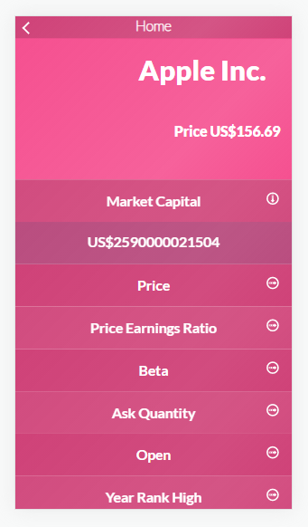

# React first project

> Started working with React

## Built With

- Html, Javascript, SCSS
- React JS (Webpack included)
- Developed in VSCode 

To get a local copy up and running follow these simple example steps.
Run:
- `git clone https://github.com/hunter4466/Metrics_webapp.git`
- `cd Metrics_webapp `
-`Install node_modules, run npm install and install 14.17.4 node version (use nvm)`
- Run 'npm run start' from the command line.

## Link

Get a live preview of the project on this link  

- Link: [Live-Preview](https://)

## Author

👤 **Mario Chois** 

- Github: [Hunter4466](https://github.com/hunter4466)

## Template author

👤 **Nelson Sakwa**

-Dribble: [nelsonbreeza](https://dribbble.com/nelsonbreeza)
-Facebook: [nelsonbreeza](https://www.linkedin.com/in/nelson-sakwa-73581435)

## 🤝 Contributing

Contributions, issues, and feature requests are welcome!

Feel free to check the issues page. [issues page](https://github.com/hunter4466/Metrics_webapp/issues).

## Show your support

Give a ⭐️ if you like this project!

## 📝 License

This project is [MIT](./MIT.md) licensed.